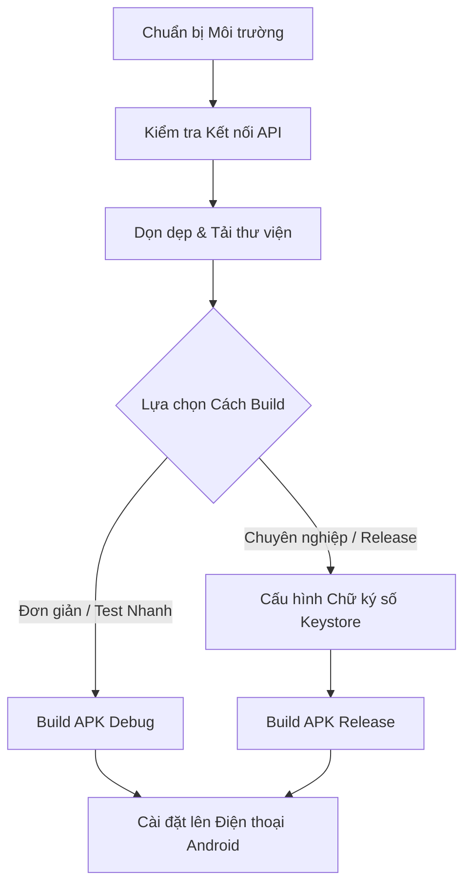

# CẨM NANG HƯỚNG DẪN ĐÓNG GÓI ỨNG DỤNG DI ĐỘNG DIENMAYPRO THÀNH FILE APK
*(Dành cho dự án mobile_app sử dụng Flutter)*

Tài liệu này hướng dẫn chi tiết quy trình từ chuẩn bị môi trường, kiểm tra cấu hình cho đến các phương pháp đóng gói ứng dụng **DienMayPro** thành file `.apk` để tải và cài đặt trực tiếp trên thiết bị Android của bạn.

---

## 🗺️ Sơ Đồ Quy Trình Thực Hiện



---

## 🛠️ Bước 1: Chuẩn Bị Môi Trường Hệ Thống

Để đóng gói (build) ứng dụng Flutter trên Windows, máy tính của bạn cần được cài đặt sẵn:

1. **Flutter SDK**: 
   * Đã cài đặt phiên bản `>=3.24.0` (theo cấu hình dự án).
   * Mở Command Prompt hoặc PowerShell và chạy lệnh sau để kiểm tra:
     ```bash
     flutter doctor
     ```
   * Đảm bảo mục `Android toolchain` và `Android Studio` đều hiển thị dấu tích xanh **[✓]**.

2. **Java Development Kit (JDK)**:
   * Yêu cầu **JDK 17** hoặc **JDK 11** (thường đi kèm sẵn khi cài đặt **Android Studio**).
   * Bạn có thể kiểm tra phiên bản Java bằng lệnh:
     ```bash
     java -version
     ```

3. **Android SDK**:
   * Được cài đặt thông qua Android Studio (bao gồm SDK Platforms, SDK Build-Tools, và NDK nếu cần).

---

## 🌐 Bước 2: Kiểm Tra Cấu Hình API Backend

Trước khi đóng gói, hãy chắc chắn rằng ứng dụng đang trỏ tới đúng máy chủ API hoạt động trực tuyến.
* File cấu hình hiện tại: `lib/core/config/api_config.dart`
* URL API đã cấu hình sẵn:
  ```dart
  static const String baseUrl = 'https://dienmaypro.nguyenanhquy.id.vn/public/api';
  ```
> [!NOTE]
> Đường dẫn trên đã trỏ trực tiếp đến tên miền Internet thật của bạn (`dienmaypro.nguyenanhquy.id.vn`). Do đó, file APK sau khi đóng gói sẽ kết nối trực tiếp đến database online mà không cần máy tính của bạn phải bật localhost hay kết nối chung mạng Wi-Fi!

---

## 🧹 Bước 3: Dọn Dẹp và Tải Lại Thư Viện

Trước khi tiến hành build, hãy dọn dẹp các tệp tin tạm và cache cũ để tránh các lỗi xung đột biên dịch ngầm.

1. Mở terminal tại thư mục dự án `mobile_app`:
   ```bash
   cd mobile_app
   ```
2. Thực hiện lệnh dọn dẹp:
   ```bash
   flutter clean
   ```
3. Tải lại toàn bộ gói thư viện đồng bộ với `pubspec.yaml`:
   ```bash
   flutter pub get
   ```

---

## 🚀 Bước 4: Tiến Hành Đóng Gói (Build APK)

Bạn có hai cách để đóng gói ứng dụng tùy theo mục đích sử dụng:

### 🌟 PHƯƠNG PHÁP 1: Build APK Debug (Khuyên dùng để Test Nhanh)
Phương pháp này cực kỳ nhanh chóng, không yêu cầu thiết lập chứng chỉ bảo mật phức tạp, file APK sinh ra có thể copy vào điện thoại để cài đặt và sử dụng ngay lập tức.

* **Lệnh thực hiện**:
  ```bash
  flutter build apk --debug
  ```
* **Đường dẫn tệp APK đầu ra**:
  Sau khi lệnh chạy hoàn tất thành công, tệp APK của bạn sẽ nằm tại:
  ```path
  mobile_app/build/app/outputs/flutter-apk/app-debug.apk
  ```

---

### 🏆 PHƯƠNG PHÁP 2: Build APK Release (Đóng gói Bản chuẩn - Tối ưu dung lượng)
Phương pháp này giúp tạo ra tệp APK có kích thước nhỏ gọn nhất, chạy mượt mà và bảo mật cao để phân phối rộng rãi hoặc đưa lên kho ứng dụng Google Play.

#### 1. Tạo file Keystore (Chữ ký số bảo mật)
Hệ điều hành Android yêu cầu các bản build Release phải được ký bằng chứng chỉ số.
* Chạy lệnh sau trong Command Prompt (quá trình này sẽ hỏi bạn nhập mật khẩu và thông tin cá nhân):
  ```bash
  keytool -genkey -v -keystore c:\Users\ANH QUY\upload-keystore.jks -storetype JKS -keyalg RSA -keysize 2048 -validity 10000 -alias upload
  ```
  *(Bạn có thể thay đổi đường dẫn lưu trữ file `.jks` tùy ý, ví dụ lưu trực tiếp trong thư mục dự án `android/app/upload-keystore.jks`)*

#### 2. Cấu hình thông tin chữ ký vào Dự án
* Tạo một tệp tin mới tên là `key.properties` nằm trong thư mục `mobile_app/android/` với nội dung sau:
  ```properties
  storePassword=<MẬT_KHẨU_KHI_TẠO_KEYSTORE>
  keyPassword=<MẬT_KHẨU_KHI_TẠO_KEYSTORE>
  keyAlias=upload
  storeFile=upload-keystore.jks
  ```
* Cập nhật file `mobile_app/android/app/build.gradle` để tự động đọc chữ ký khi đóng gói.

#### 3. Thực hiện lệnh Build Release:
* Chạy lệnh:
  ```bash
  flutter build apk --release
  ```
* **Đường dẫn tệp APK đầu ra**:
  ```path
  mobile_app/build/app/outputs/flutter-apk/app-release.apk
  ```

> [!TIP]
> Nếu bạn muốn build bản Release nhưng không muốn thiết lập cấu hình Keystore phức tạp trên Windows (để kiểm tra hiệu năng chạy thực tế), bạn cũng có thể build bản phát hành nhanh không ký số bằng lệnh:
> ```bash
> flutter build apk --split-per-abi
> ```
> Lệnh này sẽ tạo ra các file APK tối ưu dung lượng riêng biệt cho từng dòng chip điện thoại (ARM64, v7a, x86) nằm tại thư mục `build/app/outputs/flutter-apk/`.

---

## 📲 Bước 5: Cài Đặt Lên Điện Thoại Android

Sau khi đã có file `app-debug.apk` hoặc `app-release.apk`, bạn thực hiện các bước sau để cài đặt lên điện thoại di động:

1. **Chuyển file APK sang điện thoại**:
   * Cách 1: Cắm cáp USB nối điện thoại với máy tính, chép file APK vào bộ nhớ trong hoặc thẻ nhớ.
   * Cách 2: Tải file APK lên Google Drive, OneDrive hoặc gửi qua Zalo/Telegram rồi dùng điện thoại tải xuống.

2. **Cấp quyền cài đặt ứng dụng từ nguồn không xác định (Unknown Sources)**:
   * Trên điện thoại Android, đi tới **Cài đặt (Settings)** > **Bảo mật (Security & Privacy)** > **Cài đặt ứng dụng không rõ nguồn gốc (Install unknown apps)**.
   * Cho phép trình duyệt (như Chrome) hoặc ứng dụng Quản lý tệp (File Manager) cài đặt tệp APK.

3. **Cài đặt**:
   * Mở ứng dụng **Quản lý tệp (File Manager)** trên điện thoại > Tìm đến thư mục chứa file APK đã tải.
   * Ấn vào file `app-debug.apk` (hoặc `app-release.apk`) và chọn **Cài đặt (Install)**.
   * Chờ vài giây để quá trình cài đặt hoàn tất. Biểu tượng ứng dụng **DienMayPro** sẽ xuất hiện trên màn hình chính của bạn!

---

## ⚠️ Giải Quyết Các Lỗi Thường Gặp (Troubleshooting)

| Lỗi gặp phải | Nguyên nhân | Cách khắc phục |
| :--- | :--- | :--- |
| **`PUB_CACHE different roots error`** | Do dự án nằm ở ổ đĩa `D:` còn bộ đệm Flutter Cache mặc định nằm ở ổ `C:` | Chạy lệnh cấu hình biến môi trường trước khi build:<br>`$env:PUB_CACHE="D:\.pub-cache"` (trong PowerShell)<br>hoặc `set PUB_CACHE=D:\.pub-cache` (trong CMD) |
| **`Unsupported Gradle / Java version`** | Phiên bản Java trên máy tính không tương thích với phiên bản Gradle của dự án. | Đảm bảo bạn đang sử dụng Java JDK 17. Thiết lập biến môi trường `JAVA_HOME` trỏ đúng đường dẫn cài đặt JDK 17. |
| **`Android SDK not found`** | Lệnh flutter không tìm thấy thư mục Android SDK. | Chạy lệnh:<br>`flutter config --android-sdk "ĐƯỜNG_DẪN_TỚI_ANDROID_SDK_CỦA_BẠN"` |

Chúc bạn thực hiện thành công và có những trải nghiệm tuyệt vời cùng ứng dụng **DienMayPro** trên thiết bị di động!
