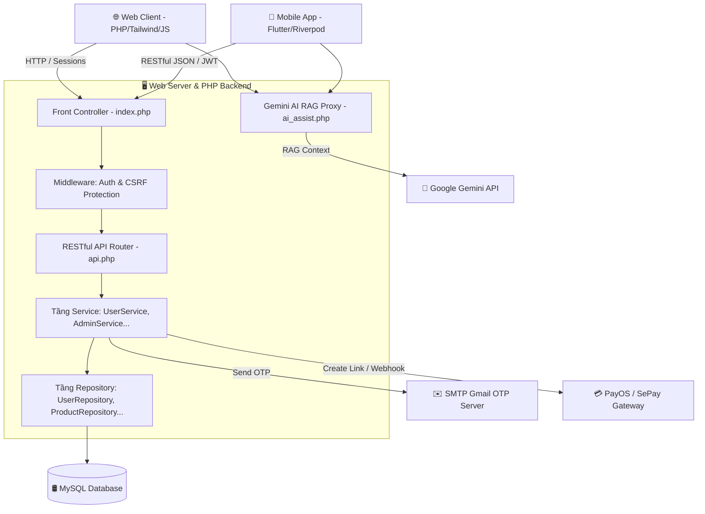

# ⚡ DienMayPro - Hệ Thống Thương Mại Điện Tử Đa Nền Tảng (Web & Flutter Mobile App)

Chào mừng bạn đến với **DienMayPro**, hệ thống thương mại điện tử chuyên nghiệp được thiết kế và tối ưu hóa toàn diện cho cả nền tảng **Website** và **Mobile Application (Flutter)**. Dự án này được xây dựng với mục tiêu giải quyết các thách thức thực tế trong vận hành e-commerce như: bảo mật người dùng, đồng bộ API session-less, trợ lý mua sắm AI thế hệ mới, so sánh sản phẩm nâng cao và tối ưu hóa hiệu năng cơ sở dữ liệu.

Đây là một dự án hoàn chỉnh (Production-ready) thể hiện tư duy thiết kế hệ thống, khả năng giải quyết xung đột logic nghiệp vụ phức tạp, và kỹ năng tối ưu hóa UI/UX chuẩn premium.

---

## 🏗️ Kiến Trúc Hệ Thống (System Architecture)

Hệ thống được thiết kế theo mô hình **Client-Server**, tách biệt hoàn toàn giữa ứng dụng di động (Flutter) và ứng dụng Web sử dụng chung một hệ thống Database MySQL thông qua API RESTful bảo mật bằng JWT.



---

## 🌟 Các Tính Năng Nổi Bật (Key Features)

### 1. 🛡️ Hệ Thống Bảo Mật & Xác Thực Đa Tầng
*   **Xác thực 2 lớp (2FA OTP Gmail):** Bảo vệ tài khoản thông qua mã OTP tự động gửi qua SMTP Gmail. Hỗ trợ đồng bộ trạng thái 2FA giữa Web và Mobile App bằng cách chuyển đổi lưu trữ OTP từ Session sang Database (có thời gian hết hạn 10 phút), giúp Mobile App xác thực session-less cực kỳ an toàn.
*   **Đăng nhập bên thứ ba:** Tích hợp Google OAuth với cơ chế tự động nhận diện redirect URL linh hoạt trên môi trường hosting (khắc phục lỗi vô hiệu hóa `putenv()` trên các hosting miễn phí).
*   **Phòng vệ Admin & Khóa tài khoản tức thì (Banned User Realtime Logout):** Khi tài khoản bị Admin khóa (`is_banned = 1`), hệ thống sẽ lập tức kích hoạt cơ chế đăng xuất bắt buộc toàn cục (ở cả Web Session lẫn JWT Bearer Token trên App di động). AJAX/API trả về HTTP 403 Forbidden, giao diện Web tự động dọn dẹp URL và hiển thị cảnh báo bằng `SweetAlert2`.
*   **Nhật ký Đăng nhập (Login Audit Log):** Lưu trữ lịch sử đăng nhập chi tiết của người dùng (IP thực qua Proxy, Trình duyệt, Thiết bị, Trạng thái thành công/thất bại) kèm công cụ quản trị phân trang và khóa tài khoản trực tiếp dành cho Admin.

### 2. 🤖 Trợ Lý Mua Sắm AI Đột Phá (Gemini AI RAG Chatbot)
*   **Cơ chế RAG (Retrieval-Augmented Generation) thông minh:** Khi người dùng đặt câu hỏi, Proxy Backend tự động phân tích từ khóa và thực hiện truy vấn SQL (`FullText` hoặc `LIKE`) để trích lọc ra tối đa 10 sản phẩm liên quan nhất trong CSDL làm ngữ cảnh (Context) bổ trợ gửi lên Google Gemini API (`gemini-2.0-flash`).
*   **Tự động nhận diện ngôn ngữ:** Chatbot tự động trả lời bằng Tiếng Anh hoặc Tiếng Việt dựa trên ngôn ngữ câu hỏi của khách hàng mà không phụ thuộc cứng vào cấu hình UI.
*   **Deep Link Parser độc đáo trên Mobile:** Toàn bộ liên kết dạng HTML do AI trả về (`<a href="...">`) được Mobile App tự động biên dịch trực tiếp thành các lệnh điều hướng nội bộ: Click vào link sản phẩm sẽ mở trang chi tiết sản phẩm (`/product/ID`), click vào link danh mục sẽ mở trang lọc (`/catalog?keyword=...`).
*   **Nhận biết ngữ cảnh (Context-Aware):** Chatbot tự động đính kèm thông tin sản phẩm khách hàng đang xem trên màn hình để tư vấn chính xác thông số kỹ thuật và so sánh giá.

### 3. 📊 Bộ So Sánh Sản Phẩm Premium (Product Comparison)
*   **Bảng So sánh Cố định Cột (Frozen Column Table):** Giao diện so sánh tối đa 3 sản phẩm cùng loại. Trên Mobile App, cột nhãn thông số được khóa cố định bên trái, các sản phẩm được cuộn ngang mượt mà.
*   **Chỉ xem điểm khác biệt (Show Differences Only):** Bộ lọc thông minh tự động ẩn các hàng có thuộc tính giống nhau, đồng thời highlight nổi bật các ô có thuộc tính khác nhau để người dùng dễ dàng ra quyết định mua sắm.
*   **Xác nhận đổi danh mục thông minh:** Khi người dùng chọn so sánh sản phẩm khác loại, hệ thống không chỉ báo lỗi chặn cứng mà sẽ hiển thị Dialog hỏi ý kiến người dùng có muốn làm sạch danh sách cũ để chuyển sang so sánh danh mục mới hay không.
*   **Thanh so sánh Sticky biến hình (Sticky Compare Bar):** Thanh chứa các sản phẩm so sánh nổi sát đáy màn hình sử dụng hiệu ứng kính mờ (BackdropFilter blur). Có khả năng thu nhỏ thành một Floating Box ở góc để tránh cản trở trải nghiệm đọc tin.

### 4. 🛒 Quản Lý Đơn Hàng & Đổi Trả Chống Xung Đột
*   **Ràng buộc logic nghiệp vụ (Business Logic Constraints):** Ngăn chặn triệt để xung đột dữ liệu: Khách hàng không thể gửi yêu cầu bảo hành cho một sản phẩm nếu đơn hàng đó đang trong trạng thái yêu cầu Trả hàng/Hoàn tiền, và ngược lại.
*   **Tối ưu hóa Truy vấn (Query Optimization):** Sử dụng các câu lệnh gộp `IN` để thu thập trạng thái bảo hành/đổi trả của toàn bộ danh sách đơn hàng chỉ bằng 1 câu query duy nhất (O(N) thay vì chạy query lặp trong vòng lặp), tối ưu hóa tốc độ tải trang đáng kể.
*   **Hủy đơn hàng tức thời:** Khách hàng có thể bấm hủy đơn hàng trực tiếp trên cả Web và Mobile App khi đơn hàng ở trạng thái chờ xử lý (`pending`), hệ thống tự động ghi nhận nhật ký hành động hủy.

### 5. 💬 Đánh Giá Sản Phẩm Đệ Quy & AJAX mượt mà
*   **Đánh giá nhiều cấp (Nested Replies):** Cho phép Admin và người dùng phản hồi trực tiếp các đánh giá sản phẩm theo dạng cây phân cấp (replies).
*   **AJAX Submit Form:** Gửi đánh giá tức thời không cần tải lại trang, đi kèm với hiệu ứng SweetAlert2 chuyên nghiệp.

### 6. 🌐 Đồng Bộ Đa Ngôn Ngữ Toàn Diện (Internationalization - i18n)
*   Hệ thống sử dụng helper `__()` và từ điển dịch thuật với hơn 350+ key chuẩn hóa cho cả hai ngôn ngữ Tiếng Việt và Tiếng Anh.
*   Đồng bộ hóa ngôn ngữ từ Web đến các thông báo trả về qua RESTful API dành cho Mobile App.

---

## 🛠️ Stack Công Nghệ (Tech Stack)

### Backend (Web & API Server)
*   **Ngôn ngữ chính:** PHP 8.x (Pure PHP, cấu trúc hướng đối tượng OOP sạch).
*   **Database:** MySQL (Sử dụng PDO, Prepared Statements để phòng chống SQL Injection tuyệt đối).
*   **Mô hình thiết kế:** Service-Repository Pattern giúp tách biệt logic nghiệp vụ khỏi logic truy xuất dữ liệu.
*   **Thư viện bên thứ ba:** PHPMailer (gửi mail OTP qua SMTP), PayOS SDK (thanh toán QR code).

### Web Frontend
*   **Styling:** Vanilla CSS & Tailwind CSS (Responsive toàn diện Mobile, Tablet, Desktop).
*   **Logic tương tác:** Native Javascript, AJAX, SweetAlert2.
*   **SEO & UX:** Tối ưu Favicon SVG tia sét sắc nét, media print ẩn sidebar/topbar khi in báo cáo doanh thu sạch sẽ.

### Mobile Application
*   **Framework:** Flutter 3.x & Dart.
*   **Quản lý trạng thái (State Management):** Flutter Riverpod (mô hình Reactive lập trình khai báo).
*   **Điều hướng (Navigation):** GoRouter (hỗ trợ Auto-Redirect bảo vệ màn hình đăng nhập, màn hình 2FA).
*   **Mạng & Lưu trữ:** Dio (tích hợp Interceptor tự động xử lý token hết hạn HTTP 401), Flutter Secure Storage (lưu JWT an toàn), SharedPreferences (lưu cache lịch sử xem sản phẩm).

---

## 📦 Cấu Trúc Mã Nguồn Chính (Source Code Structure)

```text
TrienKhaiPM/
├── core/                  # Các file helper cốt lõi (security, mail, jwt, lang)
│   ├── mail_helper.php    # Cấu hình nạp Env và gửi OTP
│   ├── jwt.php            # Xử lý Encode/Decode JSON Web Token
│   └── security.php       # Cơ chế bảo vệ CSRF, record login history
├── src/                   # Thư mục chứa các class dịch vụ nghiệp vụ
│   ├── Service/           # AdminService, UserService (xử lý logic nghiệp vụ)
│   ├── Repository/        # UserRepository (xử lý trực tiếp với MySQL)
│   └── Support/           # Env.php (đọc cấu hình file .env)
├── views/                 # Chứa giao diện website (Blade-like PHP templates)
│   ├── admin/             # Trang quản trị, lịch sử đăng nhập, in báo cáo
│   ├── api/               # Các API callback (Google login, export excel)
│   ├── pages/             # Profile, Cart, Checkout, Product Detail, Compare...
│   └── partials/          # Header, Footer, Product Card dùng chung
├── public/                # Thư mục public duy nhất được tiếp xúc với bên ngoài
│   ├── api/               # Các endpoint RESTful JSON phục vụ Mobile App
│   │   ├── auth.php       # Đăng nhập, đăng ký, 2FA OTP
│   │   ├── compare.php    # Lấy dữ liệu so sánh sản phẩm dạng JSON
│   │   ├── chatbot.php    # Proxy API Gemini + RAG SQL
│   │   └── order.php      # Quản lý đơn hàng, hủy đơn hàng
│   ├── index.php          # Front Controller, xử lý định tuyến (Router)
│   └── .htaccess          # Cấu hình Rewrite URL thân thiện và bảo mật
├── sql/                   # Thư mục chứa các file Migration Database SQL
├── docs/                  # Tài liệu hướng dẫn đóng gói APK, API specs
├── .env                   # Lưu cấu hình nhạy cảm (Được ẩn bởi .gitignore)
├── .gitignore             # File cấu hình bỏ qua git các tệp nhạy cảm/dữ liệu rác
└── ai-memory.md           # Tệp ghi nhớ tiến độ dự án
```

---

## 🚀 Hướng Dẫn Cài Đặt Local (Installation & Local Setup)

### Bước 1: Clone dự án và cấu hình Git
1. Clone dự án về máy của bạn:
   ```bash
   git clone <repository_url>
   ```
2. Dự án đã được cấu hình `.gitignore` chuẩn hóa. Bạn không cần lo lắng về việc vô tình upload các file nhạy cảm như `.env` hay các file zip dung lượng lớn lên GitHub.

### Bước 2: Thiết lập CSDL MySQL
1. Khởi động Apache & MySQL trên XAMPP hoặc WAMP.
2. Tạo một database mới tên là `dienmaypro` trong `phpMyAdmin`.
3. Import file database SQL (nằm trong thư mục `sql/` hoặc liên hệ để nhận file backup mới nhất).
4. Thực thi các file SQL bổ sung trong thư mục `sql/` để cập nhật cấu trúc bảng mới nhất (như `add_two_factor_columns_to_users.sql`, `migration_fcm_token.php`, v.v.).

### Bước 3: Cấu hình Môi trường `.env`
Tạo file `.env` ở thư mục gốc của dự án và điền đầy đủ các thông tin sau:
```env
DB_HOST=127.0.0.1
DB_PORT=3306
DB_NAME=dienmaypro
DB_USER=root
DB_PASS=

# Cấu hình gửi mail OTP 2FA qua Gmail
SMTP_HOST=smtp.gmail.com
SMTP_PORT=587
SMTP_USER=your_email@gmail.com
SMTP_PASSWORD=your_gmail_app_password_here   # Mật khẩu ứng dụng Gmail 16 ký tự

# Cấu hình Google Gemini AI Chatbot
GEMINI_API_KEY=your_gemini_api_key_here
```

### Bước 4: Cài đặt Dependencies và cấu hình Routing
1. Chạy composer để cài đặt các thư viện cần thiết:
   ```bash
   composer install
   ```
2. Nếu chạy local dưới dạng thư mục con (ví dụ: `http://localhost/TrienKhaiPM/`), Front Controller `public/index.php` sẽ tự động nhận diện tên thư mục dự án để ánh xạ route trang chủ, tránh hoàn toàn lỗi **404 Not Found**.

### Bước 5: Chạy ứng dụng di động Flutter (Nếu có)
1. Di chuyển vào thư mục ứng dụng di động:
   ```bash
   cd mobile_app
   ```
2. Cài đặt các gói phụ thuộc:
   ```bash
   flutter pub get
   ```
3. Cấu hình địa chỉ IP máy ảo kết nối đến máy chủ local của bạn trong file cấu hình API Client (`lib/core/network/api_client.dart` hoặc tương đương).
4. Khởi chạy ứng dụng:
   ```bash
   flutter run
   ```

---

## 💡 Các Giải Pháp Kỹ Thuật Đã Vượt Qua (Technical Challenges & Solved Issues)

### 1. Vấn đề "Mất Session" khi Mobile App gọi API
*   **Thử thách:** Ban đầu, các tính năng như giỏ hàng, OTP quên mật khẩu và xác minh 2FA được lưu trữ trong `$_SESSION` của PHP. Khi viết API cho Mobile App, do mobile app giao tiếp không trạng thái (stateless) nên Session luôn bị trống, dẫn đến không thể gửi OTP hoặc đặt hàng thành công.
*   **Giải pháp:** 
    *   Tích hợp JWT (`core/jwt.php`) làm Bearer Token gửi ở Header của mỗi request di động.
    *   Chuyển đổi toàn bộ các biến OTP từ Session sang lưu trực tiếp vào CSDL MySQL (bảng `users` kèm cột `expires_at`), giúp xác minh OTP session-less độc lập trên mọi thiết bị.

### 2. Xung đột logic chéo giữa Bảo hành (Warranty) và Đổi trả (Return)
*   **Thử thách:** Khách hàng có thể bấm yêu cầu đổi trả tiền cho toàn bộ đơn hàng trong khi vẫn bấm yêu cầu bảo hành cho 1 sản phẩm đơn lẻ bên trong đơn hàng đó, gây xung đột trong việc hoàn tiền và kiểm kê kho.
*   **Giải pháp:** Triển khai cơ chế kiểm tra chéo tại Tầng xử lý dữ liệu trước khi lưu yêu cầu: Chặn tạo yêu cầu bảo hành nếu đơn hàng có trong bảng `returns` và chặn đổi trả nếu có sản phẩm nào thuộc đơn hàng nằm trong bảng `warranties`.

### 3. Lỗi parse dữ liệu trên Flutter do ép kiểu động (Dart Type Cast)
*   **Thử thách:** Khi server gặp lỗi CSDL hoặc lỗi hosting (như trả về HTML lỗi 500 của Apache thay vì JSON), Dio ném ra ngoại lệ và ứng dụng Flutter bị crash trắng màn hình do lỗi `type 'String' is not a subtype of type 'Map'`.
*   **Giải pháp:** Refactor toàn bộ các hàm bắt lỗi trong Repositories của Flutter, sử dụng `Map<String, dynamic>.from(...)` an toàn và viết helper `_handleDioError` tự động kiểm tra định dạng dữ liệu đầu ra. Nếu dữ liệu nhận về là String thô, app tự động bóc tách thông báo lỗi thân thiện thay vì ép kiểu thô gây sập ứng dụng.

---

*Cảm ơn bạn đã quan tâm đến dự án **DienMayPro**. Nếu bạn là nhà tuyển dụng, hy vọng dự án này đã phần nào chứng minh được tư duy phân tích hệ thống, khả năng viết code sạch, an toàn và tinh thần giải quyết vấn đề thực tế của tôi!*
